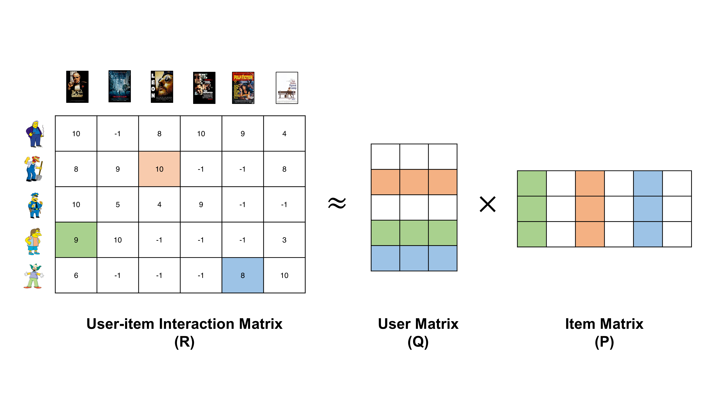
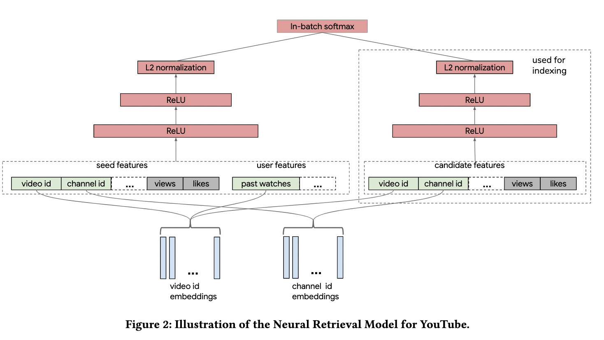

## Merlin Models

The Merlin Model Library will provide standard models for Recommender Systems, aiming for high quality implementations
from classic Machine Learning models, to more advanced Deep Learning models.

The goal of this library is make it easy for users in industry to train and deploy recommender models, with best
practices baked into the library. This will let users in industry easily train standard models against their own
dataset, getting high performance GPU accelerated models into production. This will also let researchers to build custom
models by incorporating standard components of deep learning recommender models, and then benchmark their new models on
example offline
datasets. ([full requirements doc](https://docs.google.com/document/d/1fIiDtKW3og85oiw2o4EQTaiBxqBnarBEG8KCY2V6ho8/edit#heading=h.6u157q1g2hrk))
.

## Retrieval Models

### Matrix Factorization



```python
import merlin_models.tf as ml

ml.MatrixFactorizationBlock(schema, dim=256).to_model(schema)
```

### YouTube DNN

Wang, Ruoxi, Rakesh Shivanna, Derek Z. Cheng, Sagar Jain, Dong Lin, Lichan Hong, and Ed H. Chi. “DCN V2: Improved Deep &
Cross Network and Practical Lessons for Web-Scale Learning to Rank Systems.” ArXiv:2008.13535 [Cs, Stat], October 20,
2020. http://arxiv.org/abs/2008.13535.


```python
import merlin_models.tf as ml

dims = [512, 256]
dnn = ml.inputs(schema, post="continuous-powers").apply(ml.MLPBlock(dims))
prediction_task = ml.SampledItemPredictionTask(schema, dim=dims[-1], num_sampled=500)

model = dnn.to_model(prediction_task)
```

### Two Tower

Yi, Xinyang, Ji Yang, Lichan Hong, Derek Zhiyuan Cheng, Lukasz Heldt, Aditee Kumthekar, Zhe Zhao, Li Wei, and Ed Chi.
“Sampling-Bias-Corrected Neural Modeling for Large Corpus Item Recommendations.” In Proceedings of the 13th ACM
Conference on Recommender Systems, 269–77. Copenhagen Denmark: ACM, 2019. https://doi.org/10.1145/3298689.3346996.



High-level API:

```python
import merlin_models.tf as ml

ml.TwoTowerBlock(schema, ml.MLPBlock([512, 256])).to_model(schema.select_by_name(target))
```

Low-level API:

```python
import merlin_models.tf as ml

user_tower = ml.inputs(schema.select_by_tag(Tag.USER), ml.MLPBlock([512, 256]))
item_tower = ml.inputs(schema.select_by_tag(Tag.ITEM), ml.MLPBlock([512, 256]))
two_tower = ml.merge({"user": user_tower, "item": item_tower}, aggregation="cosine")
model = two_tower.to_model(schema.select_by_name(TARGET_NAME))
```

## Ranking

### DLRM

Naumov, Maxim, Dheevatsa Mudigere, Hao-Jun Michael Shi, Jianyu Huang, Narayanan Sundaraman, Jongsoo Park, Xiaodong Wang,
et al. “Deep Learning Recommendation Model for Personalization and Recommendation Systems.” ArXiv:1906.00091 [Cs], May
31, 2019. http://arxiv.org/abs/1906.00091.


High-level API:

```python
import merlin_models.tf as ml

ml.DLRMBlock(
    schema, bottom_block=ml.MLPBlock([512, 128]), top_block=ml.MLPBlock([512, 128])
).to_model(schema)
```

Low-level API:

```python
import merlin_models.tf as ml

dlrm_inputs = ml.ContinuousEmbedding(
    ml.inputs(schema, embedding_dim_default=128),
    embedding_block=ml.MLPBlock([512, 128]), 
    aggregation="stack"
)
dlrm = dlrm_inputs.apply(ml.DotProductInteraction(), ml.MLPBlock([512, 128]))
  ```

### DCN-V2

Wang, Ruoxi, Rakesh Shivanna, Derek Z. Cheng, Sagar Jain, Dong Lin, Lichan Hong, and Ed H. Chi. “DCN V2: Improved Deep &
Cross Network and Practical Lessons for Web-Scale Learning to Rank Systems.” ArXiv:2008.13535 [Cs, Stat], October 20, 2020. http://arxiv.org/abs/2008.13535.


```python
import merlin_models.tf as ml

deep_cross_a = ml.inputs(schema, ml.CrossBlock(3)).apply(
    ml.MLPBlock([512, 256])
).to_model(schema)

deep_cross_b = ml.inputs(schema).branch(
    ml.CrossBlock(3), ml.MLPBlock([512, 256]), aggregation="concat"
).to_model(schema)

b_with_shortcut = ml.inputs(schema, ml.CrossBlock(3)).apply_with_shortcut(
    ml.MLPBlock([512, 256]), aggregation="concat"
).to_model(schema)
```

### Multi-task Learning

