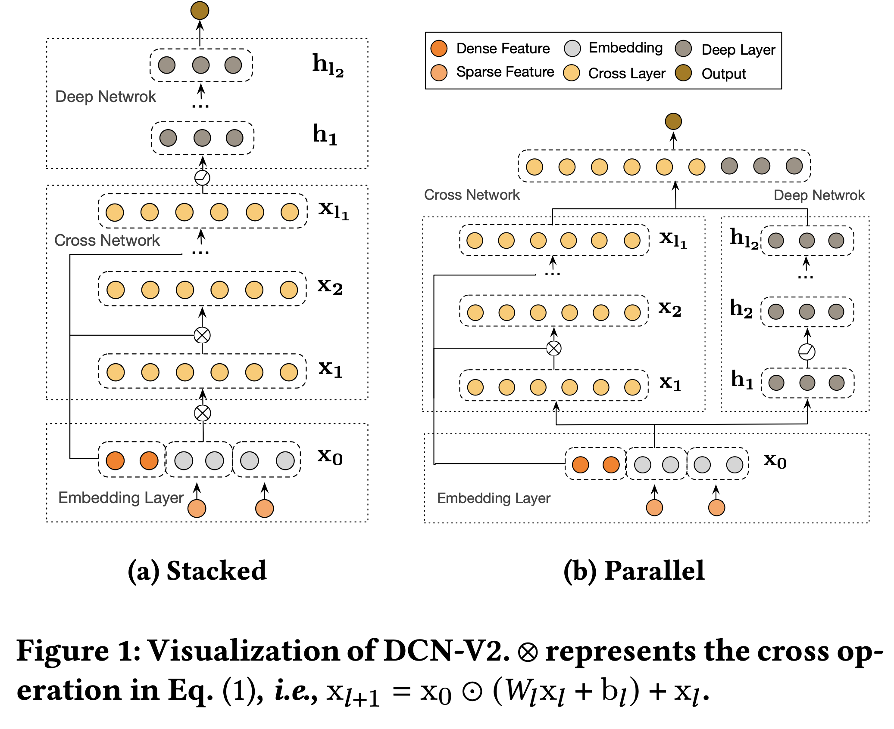
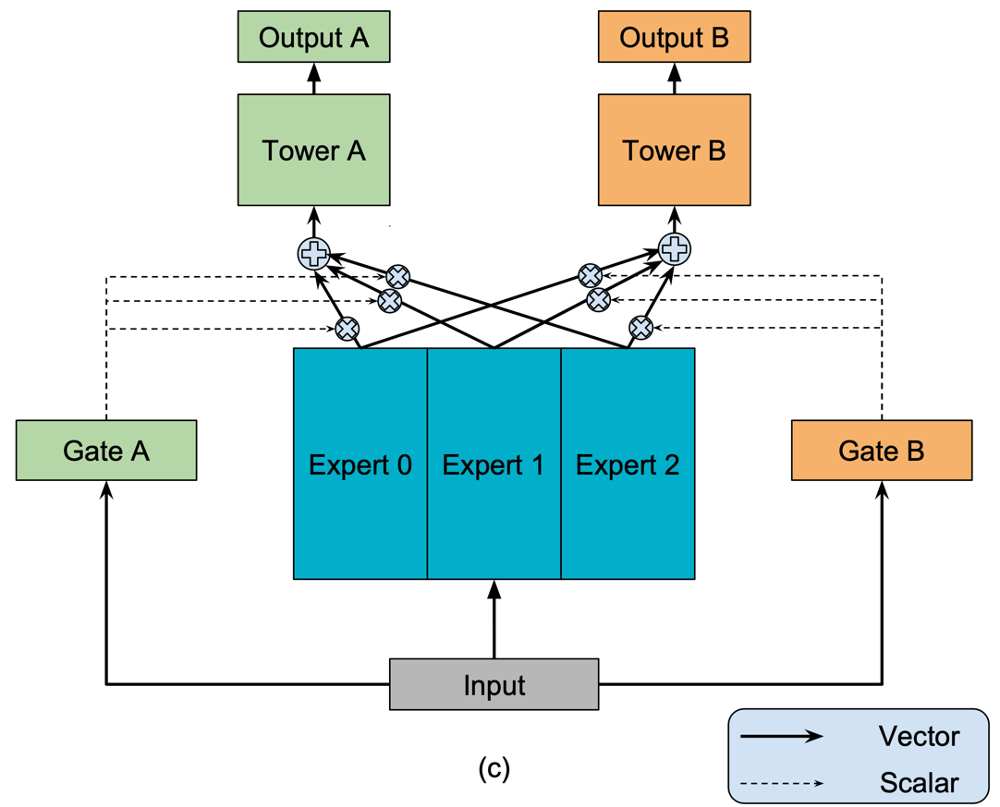
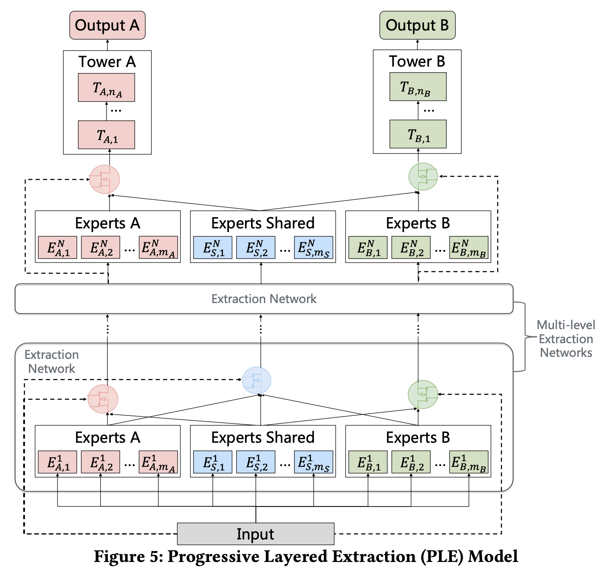

# Standard Models: Overview

## Matrix Factorization

Kumar, Saurav. (2021, July).
_Fundamentals of Matrix Factorization For Recommender System_ [Post].
LinkedIn.
<https://www.linkedin.com/pulse/fundamental-matrix-factorization-recommender-system-saurav-kumar>


```python
import merlin.models.tf as ml

ml.MatrixFactorizationBlock(schema, dim=256).connect(ml.ItemRetrievalTask())
```

## YouTube DNN

Covington, Paul, Jay Adams, and Emre Sargin. “Deep Neural Networks for YouTube
Recommendations.” In Proceedings of the 10th ACM Conference on Recommender
Systems, 191–98. Boston Massachusetts USA: ACM, 2016.
<https://doi.org/10.1145/2959100.2959190>.


```python
import merlin.models.tf as ml

model = ml.YoutubeDNNRetrieval(schema, top_layer=ml.MLPBlock([64]))
```

## Two Tower

Yi, Xinyang, Ji Yang, Lichan Hong, Derek Zhiyuan Cheng, Lukasz Heldt, Aditee
Kumthekar, Zhe Zhao, Li Wei, and Ed Chi. “Sampling-Bias-Corrected Neural
Modeling for Large Corpus Item Recommendations.” In Proceedings of the 13th ACM
Conference on Recommender Systems, 269–77. Copenhagen Denmark: ACM, 2019.
<https://doi.org/10.1145/3298689.3346996>.


High-level API:

```python
import merlin.models.tf as ml

block = ml.TwoTowerBlock(schema, ml.MLPBlock([512, 256]))
model = ml.Model(block, ml.ItemRetrievalTask())
```

Low-level API:

```python
import merlin.models.tf as ml
from merlin.schema import Tags

user_tower = ml.InputBlock(schema.select_by_tag(Tags.USER), ml.MLPBlock([512, 256]))
item_tower = ml.InputBlock(schema.select_by_tag(Tags.ITEM), ml.MLPBlock([512, 256]))
two_tower = ml.ParallelBlock({"user": user_tower, "item": item_tower})
model = ml.Model(two_tower, ml.ItemRetrievalTask())
```

## Ranking

### Deep Learning Recommender Model

Naumov, Maxim, Dheevatsa Mudigere, Hao-Jun Michael Shi, Jianyu Huang, Narayanan
Sundaraman, Jongsoo Park, Xiaodong Wang, et al. “Deep Learning Recommendation
Model for Personalization and Recommendation Systems.” ArXiv:1906.00091 [Cs],
May 31, 2019. <http://arxiv.org/abs/1906.00091>.


High-level API:

```python
import merlin.models.tf as ml

dlrm = ml.DLRMBlock(
    schema,
    embedding_dim=32,
    bottom_block=ml.MLPBlock([512, 128]),
    top_block=ml.MLPBlock([512, 128])
)
model = ml.Model(dlrm, ml.BinaryClassificationTask(schema))
```

Low-level API:

```python
import merlin.models.tf as ml

dlrm_inputs = ml.ContinuousEmbedding(
    ml.InputBlock(schema, embedding_dim_default=128),
    embedding_block=ml.MLPBlock([512, 128]),
    aggregation="stack"
)
dlrm = dlrm_inputs.apply(ml.DotProductInteraction(), ml.MLPBlock([512, 128]))
```

### DCN-V2

Wang, Ruoxi, Rakesh Shivanna, Derek Z. Cheng, Sagar Jain, Dong Lin, Lichan Hong,
and Ed H. Chi. “DCN V2: Improved Deep & Cross Network and Practical Lessons for
Web-Scale Learning to Rank Systems.” ArXiv:2008.13535 [Cs, Stat], October
20, 2020. <http://arxiv.org/abs/2008.13535>.



```python
import merlin.models.tf as ml

prediction_task = ml.BinaryClassificationTask(schema)
cross = ml.CrossBlock(3)
deep_cross_a = ml.InputBlock(schema).connect(
    cross, ml.MLPBlock([512, 256]), prediction_task
)

deep_cross_b = ml.InputBlock(schema).branch(
    cross, ml.MLPBlock([512, 256]), aggregation="concat"
).connect(prediction_task)

b_with_shortcut = ml.InputBlock(schema).connect(cross).connect_with_shortcut(
    ml.MLPBlock([512, 256]), aggregation="concat"
).connect(prediction_task)
```

## Multi-task Learning

### Mixture-of-experts

Ma, Jiaqi, Zhe Zhao, Xinyang Yi, Jilin Chen, Lichan Hong, and Ed H. Chi.
“Modeling Task Relationships in Multi-Task Learning with Multi-Gate
Mixture-of-Experts,” 2018, 1930–39. <https://doi.org/10.1145/3219819.3220007>.



High-level API:

```python
import merlin.models.tf as ml

inputs = ml.InputBlock(schema)
prediction_tasks = ml.PredictionTasks(schema)
block = ml.MLPBlock([64])
mmoe = ml.MMOEBlock(prediction_tasks, expert_block=ml.MLPBlock([64]), num_experts=4)
model = ml.Model(inputs, block, mmoe, prediction_tasks)
```

### Progressive Layered Extraction

Tang, Hongyan, Junning Liu, Ming Zhao, and Xudong Gong. “Progressive Layered
Extraction (PLE): A Novel Multi-Task Learning (MTL) Model for Personalized
Recommendations.” In Fourteenth ACM Conference on Recommender Systems, 269–78.
Virtual Event Brazil: ACM, 2020. <https://doi.org/10.1145/3383313.3412236>.



High-level API:

```python
import merlin.models.tf as ml

inputs = ml.InputBlock(schema)
prediction_tasks = ml.PredictionTasks(schema)
block = ml.MLPBlock([64])
cgc = ml.CGCBlock(
    prediction_tasks, expert_block=ml.MLPBlock([64]), num_task_experts=2, num_shared_experts=2
)
model = ml.Model(inputs, ml.MLPBlock([64]), cgc, prediction_tasks)
```
