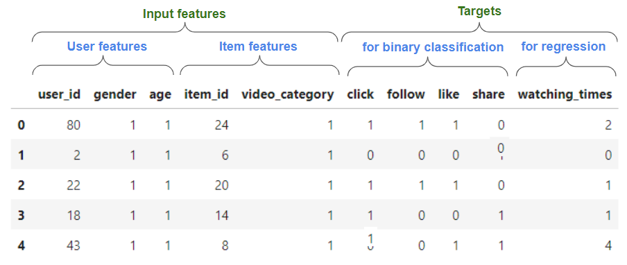

Describe best practices for:

# Preprocessing

## Data munging
- Converting data into the right shape: each each example is either a real (positive) or non-existing (negative) user-item interaction. You can see in the following example from TenRec dataset that your dataset might contain user and item features, and one or more targets, that can be either binary (for classification) or continuous/discrete (for regression).

- The input format can be CSV or Parquet, but the latter is recommended for being a columnar format which is faster to preprocess.

## Feature Engineering
- For count or long-tail distributions of continuous features, you might want to apply a log transformation before standardization. This can be done with NVTabular Log op.
- Count / Target encoding

## Filtering
- Filtering infrequent users (`--min_user_freq`) and items (`--min_item_freq`) is a common practice, as it is hard to learn good embeddings for them... Talk also about frequency capping/hashing alternatices...

## Data set splitting
- "random"
- "random_by_user"
- "temporal"

# Training

- stl_positive_class_weight
- Negative sampling: in_batch_negatives_train
- MTL aspects: --tasks_sample_space

Different ranking model characteristics
- STL: "mlp", "dcn", "dlrm", "deepfm", "wide_n_deep"
- MTL: "mmoe", "cgc","ple",

# Hyperparameter tuning

## W&B sweeps

